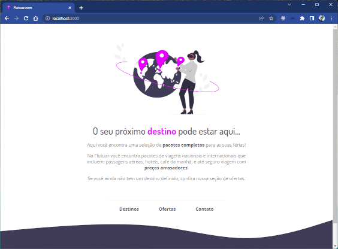

<h1 align="center">Flutuar.com</h1>

  <a href="#-deploy">Deploy</a>&nbsp;&nbsp;&nbsp;|&nbsp;&nbsp;&nbsp;
  <a href="#-tecnologias">Tecnologias</a>&nbsp;&nbsp;&nbsp;|&nbsp;&nbsp;&nbsp;
  <a href="#-projeto">Projeto</a>&nbsp;&nbsp;&nbsp;|&nbsp;&nbsp;&nbsp;
  <a href="#-layout">Layout</a>&nbsp;&nbsp;&nbsp;|&nbsp;&nbsp;&nbsp;

  

## 🚀 Deploy

  

O projeto está hospedado no Github Pages e pode ser acessado através do link [dam450.github.io/rseat-flutuar](https://dam450.github.io/rseat-flutuar/).

## 🦾 Tecnologias

Esse projeto foi desenvolvido com as seguintes tecnologias:

- HTML 
- CSS

  

## 💻 Projeto

Projeto de Landing Page de uma agencia de turismo (Parte do treinamento Explorer da Rocketseat).

## 🔖 Layout

Você pode visualizar o layout **Figma** criado para esse projeto através [AQUI](https://www.figma.com/file/jbxxgoHyL5q6RGklMq0tup/Projeto01-Extra-(Stage-2)?node-id=0%3A1&viewer=1).

## :memo: Licença

Esse projeto está sob a licença [MIT](./Licence.md).

---

Feito com ♥ by [Dam450](https://github.com/dam450/)
